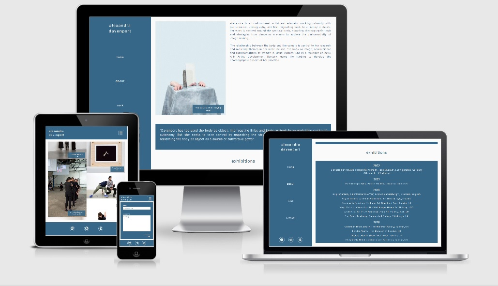

# Milestone Project One

The live site can be viewed here - [alexandra davenport](https://mitchdavenport88.github.io/MSP1/).

[Main README file.](README.md)

## Testing

My code has been put through the following:
* W3C markup validation - passed.
* W3C CSS validation - passed.
* [AutoPrefixer.](https://autoprefixer.github.io/) Validates CSS for additional browsers.

## Functionality

### Manual Testing
These are the steps I went through testing my website and it's functionality.

Navigation:
1. Clicking logo will take you take me to the home / landing page.
2. Clicking links in the navigation will take me to the right page.
3. Active page is shown in the navigation as being underlined.
4. Social links in the footer open in a new tab.
5. Page layout will change at the width of 991px and below into three sections - header, content, footer.
6. Dropdown menu works and displays links to other pages.
7. Repeat stages 2 and 3 but on the dropdown menu.
8. Footer hides on screen heights of 450px and less (use iPhone on DevTools and swap between portrait and landscape).
9. Repeat all steps on all pages.

Home:
1. Background image loads and isn't pixelated.

About:
1. Image loads on md and lg devices with text to the right.
2. Title of the work shows on the bottom right corner of the image in a blue box.
3. Image disappears at widths of 767px and below and just the text shows.
4. Everything else sits on top of one another regardless of device (quote / title / box / title / box).
5. Links work on exhibitions that have external resources and open in new tabs. Live links also have hover classes.
6. Links work on press / features / interveiws that have external resources and open in new tabs. Live links also have 
hover classes.

Work:
1. 12 images appear in total.
2. Depending on device width they will be shown in 3 columns on large, 2 columns on medium or 1 column on small screens.
3. Regardless of width the title of the work shows on the bottom right corner of the image in a blue box.

Contact:
1. Background image loads and isn't pixelated on screen width's of 768px and above.
2. Send button color will invert when hovered over.
3. Press the send button, sending an empty form. An error message about required fields appears.
4. Fill in each feild with "test test test". Press the send button. An error message about the email input not 
being valid should appear.
5. Change email feild to "test@test" and press send. Form should now send.
6. Screen width's below 768px will display just a form.
7. Repeat steps 4 and 5.
8. Send button color will invert when clicked.

Along with these tests I conducted myself, I posted my site in Code institutes #peer-code-review channel on Slack for 
feedback from fellow students. I also asked family members to view the site on whatever device they found easiest with 
no one reporting any issues.

## Responsiveness

Whilst building my site I have been checking my progress and changes using Chrome DevTools at different breakpoints. 
Also I regularly pushed my work to GitHub, so I could view the site on my iPhone and iPad via GitHub pages at varying 
stages of the build. I found that physically seeing something was more beneficial than a projection on Devtools in terms 
of judging aesthetics and getting a better feel of how it'll work.

I have tested for responsiveness on other devices using DevTools along with the Responsive Design Mode on Firefox and the 
Inspect tool on Microsoft Edge to test browser compatibility on varying devices. Using these tools I have tested on mobile 
devices as small as the iPhone 5 or the Galaxy S range as well as numerous tablet devices in landscape and portrait views.

## Browser Compatibility

I have physically tested my website on the following:
* Chrome and Microsoft Edge (desktop only).
* Safari (desktop, iPad and iPhone).
* Firefox (desktop and iPhone).

I also tested compatibility at varying screen sizes to test the responsiveness on each Browser using Chrome DevTools along 
with the Responsive Design Mode on Firefox and the Inspect tool on Microsoft Edge. Whilst doing this I encountered one 
bug whilst doing this on Firefox, which I've documented below.

## User Stories

[User story 1:](https://github.com/mitchdavenport88/MSP1/blob/master/readme-attachments/ami-responsive-user-story-1.jpg?raw=true)

I’m a curator who is planning an upcoming exhibition and I’ve been pointed towards Alex - 
I’d now like to **(1) see some examples of her work)**. I’d also like to **(2) find out abit about her)** and see what 
**(3) other exhibitions she has been involved in).** I like what I see and want to **(4) get in touch with her)** to 
discuss my upcoming exhibition. 
1) The work page shows these examples and is easily to find in both the side bar and dropdown menu.
2) The about page talks about Alexandra and her work - again easily found in both the side bar and dropdown menu.
3) A list of exhibitions past, present and future can be found on the about page.
4) I can use the contact form found on the contact page found in both the side bar and dropdown menu's or click the 
email icon found in the footer on all pages (and on all devices) to email her.

[User story 2:](https://github.com/mitchdavenport88/MSP1/blob/master/readme-attachments/ami-responsive-user-story-2.jpg?raw=true)

I’m a student who is taught by Alex. As an aspiring artist **(1) I’d like to see her work)** and use this as inspiration 
for my upcoming projects. I spend a lot of time on social media and I’d like to **(2) follow Alex on Instagram)** as I 
like her work. I can also use her posts as research for my university work and 
**(3) keep an eye out for upcoming shows and exhibitions)**. 
1) Work page shows examples of her work and is easily to find in both the side bar and dropdown menu.
2) In the footer on all pages (and on all devices) there is an Instagram icon, which will send the user to Alexandra's 
Instagram account in a new window.
3) A list of exhibitions past, present and future can be found on the about page. Also the user has the option to sign up 
to Alexandra's newsletter via mailchimp if they'd like to be kept in the loop. A link to which can be found in the footer 
on all pages (and on all devices) via the mailchimp icon.

[User story 3:](https://github.com/mitchdavenport88/MSP1/blob/master/readme-attachments/ami-responsive-user-story-3.jpg?raw=true)

I’ve recently seen some of Alex’s work at a gallery and would like to **(1) see more)**. I’d like to be informed of 
**(2) upcoming projects, exhibitions)** and news so follow her on **(3) social media)** and also 
**(4) subscribe to a mailing list)**. 
1) The work page shows more examples and is easily found in both the side bar and dropdown menu. And the plan as outlined 
in the scope is to turn this section of the site into more of a portfolio adding more content and context to the work shown.
2) A list of planned exhibitions can be found on the about page.
3) Alex only has Instagram. In the footer on all pages (and on all devices) there is an Instagram icon, which will send 
the user to Alexandra's Instagram account.
4) Next to the Instagram icon is the mailchimp icon by clicking this the user has the option to sign up to Alexandra's 
newsletter.

## Bugs & fixes

* When I first started to build this site I had an idea of how I wanted it to look on a mobile, but I didn’t take any 
account into how it would be displayed when the device is viewed horizontally. As my site breaks into three horizontal 
sections on these devices it didn’t leave a lot of room for content when used this way. I decided as content is king that 
hiding the footer to allow more room for content would be best for UX. I inserted a media query that hides the footer 
when viewed landscape but shows again when portrait/upright so the user still has access to the social links in the footer.

* When I put my code through the W3C markup validator initially it flagged up an issue on my about.html page. I had written 
h5 headings for the years within the ul tags as part of the list. I rectified this by removing the h5 elements out of 
the ul and writing individual ul’s under each heading instead of having one long list. I had to tweak my CSS styling for 
it to look the same. It then passed at the second attempt.

* During my peer review my friend Stefan pointed out the dropdown menu I'd used only collapsed once you'd 
clicked elsewhere on the page and not if you click the menu button to turn it on/off as you'd expect. Originally I used 
[this code](https://www.w3schools.com/css/css_dropdowns.asp) from W3schools to make a dropdown menu, which uses a pseudo 
class to work. I changed this code in order to make the button toggle on/off by using 
[this different code](https://www.w3schools.com/bootstrap4/bootstrap_navbar.asp) I found on W3schools.

* Whilst using the Responsive Design Mode on Firefox I noticed the submit button on my contact page was hugging the bottom 
of the blue box my form is displayed in - 
[shown here](https://github.com/mitchdavenport88/MSP1/blob/master/readme-attachments/firefox-iphone6-test(responsive-design-mode).png?raw=true). 
This was unexpected as I have padding all around the box so there should be a gap between the button and the bottom of the 
box. This was only occurring whilst using Firefox as I also checked on  Edge and Chrome. I downloaded Firefox onto my phone 
to double check and it displayed in this case as expected, with a gap - 
[(as shown here)](https://github.com/mitchdavenport88/MSP1/blob/master/readme-attachments/firefox-iphone6-test(actual-phone).png?raw=true).
So I'm putting this down to the Responsive Design Mode being a tool that replicates how it thinks it'll render but in 
this instance it doesn't actually render as predicted.

* My initial plan was to have a hidden scrollbar and I found the code to achieve this on 
[w3schools](https://www.w3schools.com/howto/howto_css_hide_scrollbars.asp). However using this code caused a number of issues:
    * Failed the CSS validator test as it didnt recognise the property `scrollbar-width: none;`. I did test this property by
removing it and running the code and the scrollbar appeared so the property appeared to work as intended. I also found 
this article on [stack overflow](https://stackoverflow.com/questions/64973672/property-scrollbar-width-doesnt-exist-none-error) 
and after reading was happy to continue using the code.
    * During testing it was asked by a couple of family members "does this scroll?", which made me think that it might not be 
as obvious as I thought; so I took the decision to remove the code. I do now realise that showing this is good for 
usability and accessibility purposes and that function over form is more important.
    * I looked into the idea of styling the scrollbar, as it would predominantly be seen on the about and work pages. I read 
this article on [css-tricks](https://css-tricks.com/the-current-state-of-styling-scrollbars/) and played with some of the code 
shown on here. But after further reading about compatibility with firefox and the use of JavaScript to achieve this properly I 
took the decision to have the default scrollbar and styled my content to suit. 